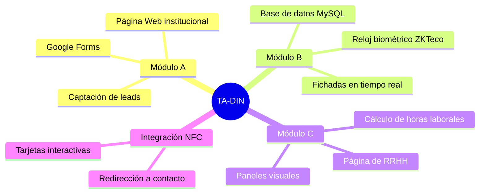
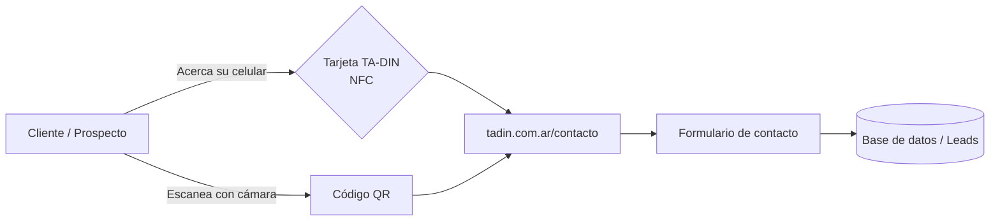
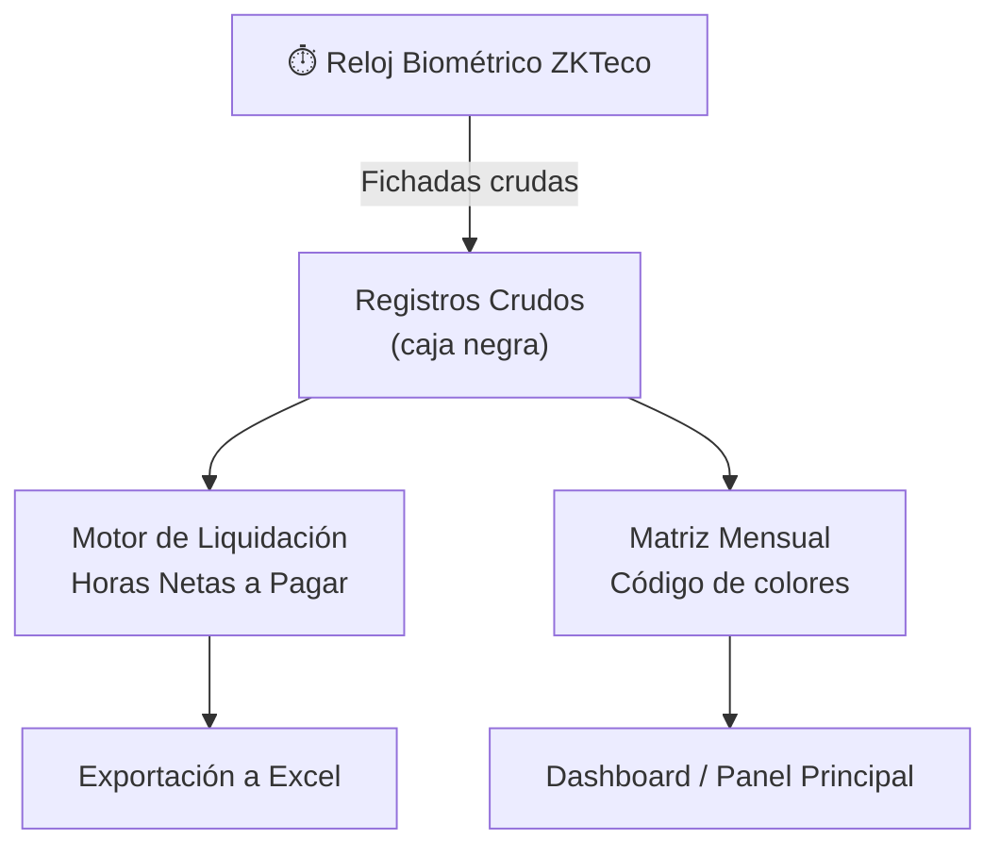
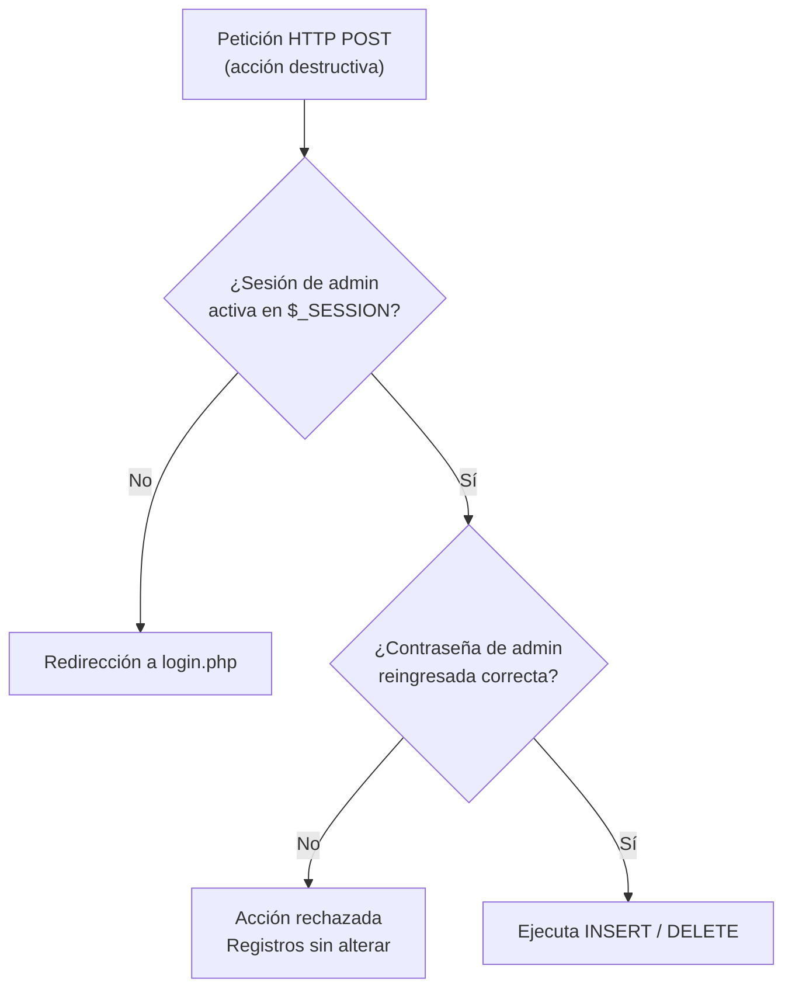
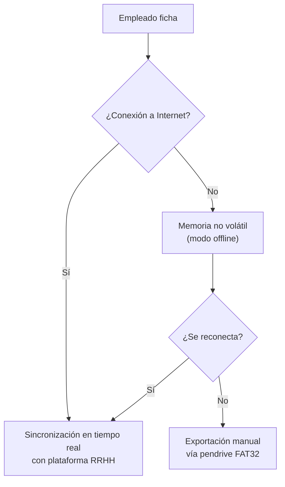

# 🏭 Proyecto TA-DIN

### Digitalización de Procesos Industriales — Pintura Electrostática

**Hacia la certificación ISO 9001 e ISO 14001**

`Equipo N° 6` · `7° Informática B` · `Septiembre 2026`

---

> 📌 **Cómo usar esta presentación:** cada sección a continuación es una "diapositiva" desplegable.
> Hacé clic sobre el título (▶) para expandirla y ver su contenido, diagramas y tablas.

---

## 👥 Equipo de Trabajo

| Integrante | Rol |
|---|---|
| **Mía Niello** | PM / Frontend |
| **Catalina Quintana** | Frontend · UX/UI |
| **Tatiana Bravo** | Backend |
| **Nicolás Perri** | DB · Backend |
| **Milagros Camino** | Infraestructura de Seguridad |

---

<h2>📑 Diapo 1 — Propósito del Proyecto y Módulos</h2>

**TA-DIN** es una empresa de servicios de **pintura electrostática** que busca profesionalizarse para captar clientes en los sectores **petrolero, minero y telefónico**.

> El proyecto consiste en la digitalización de algunos de los procesos de la empresa, permitiéndole avanzar en la certificación de las normas **ISO 9001** e **ISO 14001**.

### 🧩 Módulos del Proyecto

| Módulo | Nombre | Descripción |
|---|---|---|
| **A** | Página Web | Interfaz pública para posicionar la presencia digital de TA-DIN, canalizar consultas (Google Forms) y captar potenciales clientes de forma ágil. |
| **B** | Reloj Biométrico de Asistencias | Registra e integra fichadas en tiempo real mediante hardware **ZKTeco**, conectado a una base de datos MySQL, para el seguimiento exacto de presentismo y horarios. |
| **C** | Página de Recursos Humanos | Procesa los datos de asistencia para generar paneles visuales y contabilizar las horas laborales de los empleados. |

**Integración NFC:** tarjetas de presentación interactivas para reuniones o eventos comerciales, que redirigen al cliente directamente a la sección de contacto.

---

<h2>🌐 Diapo 2 — Avances: Web institucional e Integración NFC</h2>

### Estado actual

- La estructura principal de **`tadin.com.ar`** se encuentra **terminada**; los avances recientes fueron modificaciones y ajustes mínimos.
- Se desplegó una ruta de contacto: **`tadin.com.ar/contacto`**, destinada a la interacción con clientes.

### 📇 Tarjetas NFC + Código QR

La información de la empresa se transmite mediante tarjetas con tecnología **NFC** (*Near Field Communication*). Además, cuentan con **código QR** como respaldo para dispositivos móviles sin soporte NFC.

---

<h2>🖥️ Diapo 3 — Plataforma de Recursos Humanos</h2>

### Módulos de la plataforma

- **Dashboard (Panel Principal):** resumen en tiempo real del estado de red (IP y puerto del reloj biométrico), cantidad de empleados activos, fichadas del día y las últimas 5 movimientos físicos.
- **Empleados:** gestión de alta y baja de personal. ⚠️ El **"ID de Reloj"** debe coincidir exactamente con el número de enrolamiento asignado en el dispositivo físico ZKTeco.
- **Registros Crudos:** actúa como la "caja negra" del sistema, mostrando todas las entradas y salidas sin procesar. Permite **Cargas Manuales** para justificar ausencias u olvidos (requiere contraseña de administrador).
- **Motor de Liquidación (Horas Trabajadas):** filtra llegadas tarde y turnos incompletos para calcular las **Horas Netas a Pagar**. Permite exportar la liquidación mensual a Excel.
- **Configuración:** panel para actualizar IP del reloj, horarios de turnos corporativos (mañana/tarde) y minutos de tolerancia.

### 🗓️ Matriz Mensual — Código de colores

| Color | Significado |
|---|---|
| 🟩 **Verde** | Presente |
| 🟧 **Naranja** | Llegada tarde |
| 🟦 **Azul** | Olvido de fichada de salida |
| 🟥 **Rojo** | Ausente |
| ⬜ **Gris (luna)** | Fichada fuera de horario de turno |

---

<h2>🔐 Diapo 4 — Seguridad y Stack Tecnológico</h2>

### Doble capa de protección

1. **Control de Sesión Nativo (`$_SESSION`):** toda la navegación y acceso a rutas `.php` requiere una sesión de administrador activa iniciada en `login.php`. Sin token válido, el servidor redirige de inmediato al login.
2. **Protocolo de Confirmación de Privilegios:** para acciones sensibles (cargas manuales, justificaciones, bajas de registros), la sesión activa **no alcanza**. El servidor exige el **reingreso de la contraseña de administrador** en toda petición **HTTP POST** destructiva, validándola nuevamente contra la base de datos antes de ejecutar `INSERT` o `DELETE`.

### 🛠️ Stack Tecnológico Comparativo

| Módulo | Tecnología | Función |
|---|---|---|
| Módulo A — Web | **HTML5 / CSS3** | Diseño responsivo (desktop y mobile) |
| Módulo A — Hosting | **DonWeb (FTP / FileZilla)** | Alojamiento y despliegue del sitio |
| Módulo B — Hardware | **ZKTeco + ZKBioTime.Net** | Biometría, comunicación TCP/IP, enrolamiento |
| Módulo C — Backend | **PHP 8** | Renderizado del lado del servidor (SSR) |
| Módulo C — Frontend | **Bootstrap 5.3 + JS Vanilla** | Interfaz de la plataforma de RRHH |
| Módulo C — Base de Datos | **MySQL** | Persistencia relacional (`empleados`, `registros_asistencia`, `configuracion`) |
| Módulo C — Exportación | **`.xls` (HTTP headers nativos)** | Reportes de liquidación |

> 💡 **Detalle técnico:** el motor de exportación a Excel se genera mediante inyección de HTML/CSS con cabeceras `application/vnd.ms-excel`, sin librerías externas.

---

<h2>📘 Diapo 5 — Manual de Usuario y FAQ</h2>

### ⏱️ Reloj Biométrico (Hardware — iFace)

- **Métodos de identificación:** reconocimiento facial, huella dactilar, contraseña o tarjeta RFID.
- **Modos:** `1:N` (directo, sin tocar el equipo) o `1:1` (ingresando primero el ID).

**Pautas de uso correcto:**
- **Rostro:** ubicarse a 0,5 metros, postura erguida, expresión neutra, sin gorras ni anteojos de sol.
- **Huella:** apoyar el dedo plano y centrado en el cristal (se recomienda índice o medio). Registrar al menos 2 huellas + rostro por persona.

### ⚡ Contingencia y Mantenimiento

> **Modo offline:** el reloj posee memoria no volátil. Ante un corte de internet, sigue funcionando localmente y **sincroniza automáticamente al reconectarse** (o vía pendrive en formato FAT32).

- **Mantenimiento de pantalla táctil:** limpieza con paño seco + calibración en 5 puntos.

### 💻 Plataforma Web (Software) — Reglas de negocio

- Tolerancias, horas extra y turnos se configuran **solo en la plataforma web**, no en el reloj.
- El **ID de Reloj** del sistema debe coincidir con el ID físico del ZKTeco para vincular marcas correctamente.
- Toda carga manual o corrección requiere **contraseña de administrador**.

---

**Proyecto TA-DIN** · Equipo N° 6 · 7° Informática B · 2026

